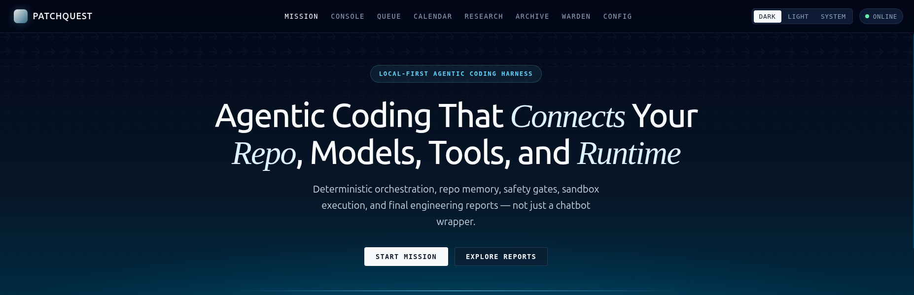

# PatchQuest

**Local-first agentic coding harness for small and open-weight models.**



PatchQuest is a full-stack application—not a chat wrapper—that runs coding tasks through a deterministic phase pipeline. It combines repo indexing, role-isolated LLM calls, command safety checks, optional Docker sandboxing, structured patching, test execution, and PR-style final reports. A React mission-control UI streams run progress in real time.

Repository: [github.com/MrAnayDongre/PatchQuest](https://github.com/MrAnayDongre/PatchQuest)

---

## Why PatchQuest

Small coding models fail when given open-ended autonomy. PatchQuest constrains them with:

- **Fixed phase order** — intake through final report, with explicit skip/fail semantics
- **Scoped context** — each role receives only the files and tools relevant to its phase
- **Safety before execution** — SecretGuard, path checks, and command risk classification run before shell access
- **Observable runs** — every transition is persisted to SQLite and streamed over SSE

Mock mode runs the entire pipeline with deterministic outputs, so you can evaluate the product without API keys.

---

## Features

| Area | What it does |
|------|----------------|
| **Orchestration** | 12-phase state machine with event bus, approvals, and read-only task detection |
| **Providers** | Mock, NVIDIA NIM/Build, OpenAI, Anthropic, Groq, Ollama, OpenRouter, OpenAI-compatible |
| **Runtime** | Local host execution or isolated Docker sandbox |
| **Repo memory** | Per-repo facts with hash-based invalidation; Tree-sitter symbol extraction + code graph |
| **Scheduler** | One-shot and recurring tasks with provider/model/runtime/memory preserved per task |
| **Web search** | Brave, Tavily, Serper, SerpApi, Google Programmable Search, DuckDuckGo, custom endpoint |
| **Calendar** | Local SQLite calendar, ICS export, CalDAV/Google/Microsoft provider scaffolding |
| **Safety** | SecretGuard, four-tier command risk, workspace boundaries, approval queue |
| **Frontend** | Mission console, phase rail, reports, safety queue, scheduler, search, calendar, 8 mini-games |

---

## Architecture

```
┌─────────────────┐        SSE         ┌─────────────────────┐
│    Frontend      │◄──────────────────►│      Backend         │
│  React + Vite    │     REST           │  FastAPI + SQLite    │
└─────────────────┘                    └──────────┬────────────┘
                                                │
              ┌─────────────────────────────────┼─────────────────────────┐
              │                                 │                         │
       ┌──────▼──────┐                  ┌───────▼───────┐         ┌───────▼───────┐
       │ Orchestrator │                  │    Agents      │         │    Tools       │
       │ State machine│                  │  Provider layer│         │  SecretGuard   │
       │  Event bus   │                  │  Role prompts  │         │  Command risk  │
       └──────────────┘                  └───────────────┘         │  Patch / git   │
                                                                   └───────────────┘
```

See [docs/ARCHITECTURE.md](docs/ARCHITECTURE.md) for module-level detail.

### Orchestration phases

| # | Phase | Purpose |
|---|-------|---------|
| 1 | `intake` | Classify task type, risk, and languages |
| 2 | `repo_scan` | Index files; extract symbols (Tree-sitter or fallback) |
| 3 | `planning` | Produce bounded execution plan |
| 4 | `research` | Web search for docs, CVEs, dependencies when needed |
| 5 | `context_building` | Select minimal relevant files via code graph |
| 6 | `analysis` | Read-only inspection output (skipped for mutation tasks) |
| 7 | `patching` | Propose and apply structured diffs |
| 8 | `static_checks` | Linters and type checkers |
| 9 | `testing` | Auto-detected test suites (pytest, npm, cargo, go, make) |
| 10 | `review` | Minimality and correctness review |
| 11 | `security_scan` | SecretGuard + pattern analysis |
| 12 | `final_report` | Markdown report with diffs, commands, and findings |

---

## Quick start

### Prerequisites

- Python 3.11+
- Node.js 18+
- npm

### Backend

```bash
cd backend
python -m venv .venv
source .venv/bin/activate          # Windows: .venv\Scripts\activate
pip install -e ".[dev]"
uvicorn patchquest.main:app --reload --port 8000
```

Entry point: `backend/patchquest/main.py`

### Frontend

```bash
cd frontend
npm install
npm run dev
```

Open http://localhost:5173. The status banner confirms backend connectivity.

### First run

1. Enter a local repository path.
2. Describe a task (e.g. inspect the repo without modifying files).
3. Choose provider (Mock Demo works without keys), runtime, and memory mode.
4. Click **Start Mission** and watch the phase rail update live.
5. Open the final report when the run completes.

---

## Configuration

Copy `sample.config.yaml` to `config.yaml` in the directory where you start the backend, or set `PATCHQUEST_CONFIG` to an absolute path.

```yaml
models:
  planner:
    provider: ollama
    model: qwen2.5-coder:0.5b
  coder:
    provider: openai_compatible
    base_url: http://localhost:8000/v1
    model: local-coder
    api_key_env: LOCAL_LLM_API_KEY   # env var name only — never store keys in config

runtime:
  default: local
  docker:
    image: patchquest-sandbox:latest

scheduler:
  enabled: true
  poll_interval_seconds: 30

memory:
  mode: repo   # off | session | repo | user
```

**API keys** are read from environment variables at runtime. Keys are not logged, persisted to SQLite, or sent to the frontend.

### Provider environment variables

| Provider | Variable |
|----------|----------|
| OpenAI | `OPENAI_API_KEY` |
| Anthropic | `ANTHROPIC_API_KEY` |
| Groq | `GROQ_API_KEY` |
| NVIDIA NIM / Build | `NVIDIA_API_KEY` |
| OpenRouter | `OPENROUTER_API_KEY` |
| Brave Search | `BRAVE_SEARCH_API_KEY` |
| Tavily | `TAVILY_API_KEY` |

NVIDIA uses the Responses API (`/responses`). Get a key at [build.nvidia.com](https://build.nvidia.com). Models include `openai/gpt-oss-120b` and `openai/gpt-oss-20b`.

---

## Scheduler (Quest Queue)

Schedule one-shot or recurring runs from the **Queue** page. Each task stores:

- LLM provider and model
- Runtime mode (`local` or `docker`)
- Memory mode
- Timezone (IANA, e.g. `America/Los_Angeles`)

Schedule types: one-shot (ISO datetime), interval (`30m`, `2h`), daily (`09:00`), weekly (`mon,09:00`), cron (requires `croniter`).

Scheduled runs use the same orchestrator path as manual missions. If a selected provider has no configured API key, the run fails with a clear error—there is no silent fallback to mock unless Mock Demo is explicitly selected.

---

## Docker sandbox

Build the sandbox image:

```bash
docker build -t patchquest-sandbox:latest docker/sandbox
```

Select **Docker** in the runtime dropdown or set `runtime_mode: docker` on a run or scheduled task.

- Commands run with `--network none` by default
- Only the workspace is mounted; no SSH or cloud credential paths
- Memory, CPU, and PID limits are enforced
- Command risk classification and SecretGuard still apply inside the container

If Docker is unavailable, the runtime status API reports the condition without crashing the app.

---

## Example API usage

```bash
# Health check
curl http://localhost:8000/api/health

# Create a run
curl -X POST http://localhost:8000/api/runs \
  -H "Content-Type: application/json" \
  -d '{
    "repo_path": "/path/to/repo",
    "task": "Summarize architecture in 3 bullets. Do not modify files.",
    "provider": "mock",
    "runtime_mode": "local",
    "memory_mode": "repo"
  }'

# Stream events (SSE)
curl -N http://localhost:8000/api/runs/{run_id}/stream

# Final report
curl http://localhost:8000/api/reports/{run_id}
```

Full route list: [backend/README.md](backend/README.md)

---

## Running tests

```bash
# Backend (331 tests)
cd backend
source .venv/bin/activate
python -m pytest

# Frontend
cd frontend
npm run typecheck
npm run test
npm run build
```

Optional Tree-sitter parsers:

```bash
pip install -e ".[tree-sitter]"
```

---

## Project structure

```
PatchQuest/
├── backend/
│   ├── patchquest/
│   │   ├── main.py              # FastAPI entry
│   │   ├── database.py          # SQLite schema + migrations
│   │   ├── api/                 # REST routes
│   │   ├── orchestrator/        # State machine, phases, approvals
│   │   ├── agents/              # LLM providers and roles
│   │   ├── tools/               # SecretGuard, command runner, patches
│   │   ├── memory/              # Indexer, Tree-sitter, code graph
│   │   ├── search/              # Web search providers
│   │   ├── calendar/            # Calendar providers
│   │   ├── scheduler/           # Quest Queue
│   │   ├── runtime/             # Local + Docker execution
│   │   └── reports/             # Final report generator
│   └── tests/
├── frontend/src/
│   ├── pages/                   # Mission, Console, Queue, Reports, …
│   ├── components/              # Shared UI
│   ├── games/                   # Mini-games during long runs
│   └── theme/                   # Dark/light design tokens
├── docker/sandbox/              # Sandbox Dockerfile
├── docs/
│   ├── ARCHITECTURE.md
│   └── assets/patchquest.png
├── sample.config.yaml
├── CONTRIBUTING.md
├── SECURITY.md
└── LICENSE
```

---

## Safety model

**Command risk** (deterministic, no LLM):

| Level | Behavior |
|-------|----------|
| `no_risk_auto` | `ls`, `git status`, `grep`, `python --version` — runs immediately |
| `careful_auto` | `pytest`, `npm test`, `cargo check` — timeout + output cap |
| `risky_ask` | `npm install`, `git checkout`, `curl` — requires UI approval |
| `blocked` | `rm -rf /`, `curl\|bash`, `git push --force`, `sudo`, `~/.ssh` — never runs |

**SecretGuard** scans diffs, command output, memory, and reports. It blocks patches that introduce hardcoded secrets and redacts detected values in all outputs.

---

## Current limitations

- **Mock provider** returns deterministic placeholder content—connect a real provider for actual inference.
- **Single-user local tool** — no authentication or multi-tenant isolation.
- **DuckDuckGo search** returns instant answers only; paid providers give full web results.
- **Google/Microsoft calendar** require externally obtained OAuth credentials.
- **Cron scheduling** uses a simple fallback unless `croniter` is installed.
- **Docker diff application** may require approval before changes are merged back to the host repo.

---

## Roadmap

- Kubernetes remote runners
- GPU benchmark tracking
- Multi-repo shared memory
- Plugin system for custom tools and checks
- Team mode with shared audit trail
- Automated OAuth flows for Google/Microsoft calendar

---

## Contributing

See [CONTRIBUTING.md](CONTRIBUTING.md).

## Security

See [SECURITY.md](SECURITY.md) for reporting vulnerabilities and secret-handling policy.

## License

MIT — see [LICENSE](LICENSE)
