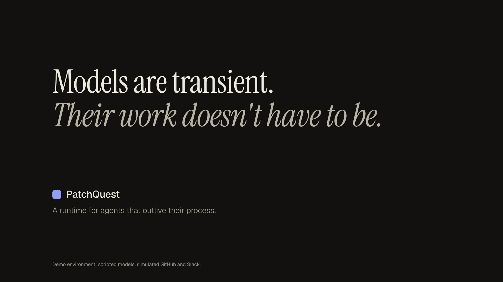
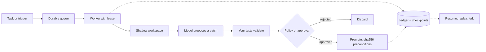

<div align="center">

# PatchQuest

**A durable runtime for long-horizon software agents.**

*Models are transient. Their work doesn't have to be.*

[](https://github.com/MrAnayDongre/PatchQuest/actions/workflows/ci.yml)
[](LICENSE)


[Docs](docs/QUICKSTART.md) · [Architecture](docs/ARCHITECTURE.md) · [Security](SECURITY.md) · [Evaluation](docs/evaluation.md) · [Contributing](CONTRIBUTING.md)

</div>

PatchQuest runs coding agents as durable, resumable work instead of one fragile process. A model proposes changes inside an
isolated copy of your repository; your own tests validate them; policy or a person approves them; every step lands in an
append-only ledger with checkpoints. If the worker dies, another one picks the run up where it stopped, and the repository is
written once or not at all. The same engine runs on a laptop with a local model, or as a team server on PostgreSQL.

## See it

<!-- PATCHQUEST_DEMO_VIDEO: replace with GitHub user-attachment URL before launch -->
[](docs/DEMO_QUALIFICATION.md)

*The film is a 25-second tour of the demo environment. Until it is attached here, the poster links to the qualification record
the film was made from.*

## Why PatchQuest?

| Problem with long-running agents | What PatchQuest does |
|---|---|
| The host process dies halfway through a change | Checksummed checkpoint after every phase; another worker takes over the run and never repeats an uncertain write |
| A model edits your working tree directly | Changes happen in a shadow workspace and are promoted once, with sha256 preconditions, after validation |
| "Why did it do that?" has no answer | Append-only event ledger; recorded reasons for chosen test commands, memories and patches |
| A bad run cannot be reproduced | Replay from recorded model output with no model call, or fork from any checkpoint with a different model or setting |
| Risky commands run unattended | A deterministic policy gate before every command; approvals for risky actions and unvalidated patches |
| Automation is a pile of scripts | Durable workflows: trigger → agent → condition → approval → actions, with a visual builder |
| You cannot tell if a model or harness change helped | Evaluation corpus with hidden oracles, failure attribution, paired experiments |

## PatchQuest is not another coding model

It does not generate code better than the model you plug in. It is the harness around a model: fixed phases, scoped context,
deterministic safety checks, recovery rules and an audit trail. The guarantees do not depend on which model runs. Ollama, vLLM,
SGLang, llama.cpp, LM Studio, any OpenAI-compatible endpoint and hosted APIs are all reached through one provider interface.

## Capabilities

**Durable execution**
- Typed run state machine, checkpoint after every phase, `resume` that explains what it will do before it does it
- Worker leases with epoch fencing: a paused worker that wakes after losing its lease cannot write to the run
- Replay (`state`, `model`, `live`) and fork from any checkpoint

**Safe autonomy**
- Shadow workspace, validated patch, promotion with sha256 preconditions and a journal
- Scoped, versioned policy: strictest wins, narrower scopes can only tighten, a system floor cannot be lowered
- Docker sandbox runtime: no network, capabilities dropped, read-only root (not a VM, see [Security](#security-and-sandboxing))

**Agent infrastructure**
- Durable workflows with a visual builder; GitHub, Slack, Linear, Jira, Notion (read-only) and webhook connectors
- Manifest-declared plugins with explicit grants, containment and quarantine
- Workspaces, teams, projects, RBAC and tenant isolation; local SQLite or PostgreSQL with queued workers

**Evidence and learning**
- OTLP traces, metrics, a per-run "why" record
- Scoped memory and preferences, a repository profile
- Evaluation corpus, model matrix, a Gymnasium-style gym and real runs exported as trajectories

## Agents can outlive their worker

This is the property the rest is built around. In the qualified demo, a worker was `SIGKILL`ed immediately after checkpoint #6:

| | |
|---|---|
| worker-1 | killed after checkpoint #6 |
| worker-2 | took the run over and resumed at `patching` |
| planner | ran once |
| patch | applied once |
| duplicate side effects | 0 |

Reproduce it yourself with `patchquest demo crash` (below). The recorded evidence, with the gate table and limitations, is in
[docs/DEMO_QUALIFICATION.md](docs/DEMO_QUALIFICATION.md).


## Quickstart

**Requirements:** Python 3.11+, Git. Node 20 only to build the web UI. Docker only for the Docker sandbox runtime.

```bash
git clone https://github.com/MrAnayDongre/PatchQuest.git && cd PatchQuest/backend
python3 -m venv .venv && . .venv/bin/activate
pip install -e ".[tree-sitter]"
patchquest doctor          # checks the installation and the safety boundaries
```

### Try PatchQuest without an API key

The demo environment uses scripted model answers and simulated GitHub and Slack servers, so it needs no keys and no GPU.
The pipeline, ledger, workflow engine, policy and metrics are the real ones.

```bash
(cd ../frontend && npm ci && npm run build)    # the web UI; skip to use the CLI and API only
PATCHQUEST_STATIC_DIR=../frontend/dist patchquest demo      # http://127.0.0.1:8765
patchquest demo trigger     # a signed webhook starts a real run; approve it in the UI
patchquest demo crash       # SIGKILL a worker mid-run; another finishes it
patchquest demo reset
```

More in [docs/demo.md](docs/demo.md).

### Your first task

Start any OpenAI-compatible local server, then:

```bash
patchquest run --repo ~/code/app --task "Fix add() so it returns the sum" \
  --provider sglang --model Qwen/Qwen3-0.6B --base-url http://localhost:30000/v1
patchquest status RUN      # RUN is the id printed by `run`
patchquest report RUN
```

If the run is interrupted: `patchquest resume RUN --plan` shows what resuming would do. Exit codes: `0` ok, `1` failed,
`2` patch rejected, `3` interrupted, `4` a person must decide first.

## How it works


```mermaid
flowchart LR
  T[Task or trigger] --> Q[Durable queue]
  Q --> W[Worker with lease]
  W --> S[Shadow workspace]
  S --> M[Model proposes a patch]
  M --> V[Your tests validate]
  V --> A{Policy or approval}
  A -->|approved| P[Promote: sha256 preconditions]
  A -->|rejected| X[Discard]
  W -.-> L[(Ledger + checkpoints)]
  P -.-> L
  L -.-> R[Resume, replay, fork]
```

1. A task arrives from the CLI, API, UI or a workflow trigger and is queued.
2. A worker claims it with a lease and copies the repository into a shadow workspace.
3. The model plans and proposes edits; every command passes the policy gate first.
4. The repository's own tests validate the patch, with bounded repair rounds.
5. Policy or a person approves; the patch is promoted once, with sha256 preconditions.
6. After every phase a checksummed checkpoint is written; a lost lease lets another worker resume the run.
7. Anything recorded can be inspected, replayed without a model call, or forked.

Details: [Architecture](docs/ARCHITECTURE.md), [runtime](docs/runtime.md), [checkpoints](docs/checkpoints.md), [replay](docs/replay.md).


## Local mode and server mode

| | Local | Team server |
|---|---|---|
| Database | SQLite | PostgreSQL |
| Workers | In-process or `patchquest worker` | Any number, on hosts that reach the database, claiming with leases (`SKIP LOCKED`) |
| Identity | Single user | Organizations, workspaces, teams, RBAC, API tokens |
| Start | `patchquest run` / `patchquest serve` | `pip install -e ".[server]"`, set `PATCHQUEST_DATABASE_URL`, `patchquest admin init`, `patchquest serve` + `patchquest worker` |

PatchQuest is a modular monolith with durable workers and one primary database. It does not need Kafka, Redis, Kubernetes or a
vector store, and it is not a microservice system. Server mode is covered in [docs/QUICKSTART.md](docs/QUICKSTART.md) and
[docs/deployment.md](docs/deployment.md); `docker compose -f docker-compose.server.yml up -d --scale worker=3` starts the whole stack.

## Workflows

A workflow is durable: it survives restarts like a run does.

```text
Webhook (issue opened) → Agent run → Validate (tests) → Approval → GitHub comment + Slack message
```

In the demo, GitHub and Slack are protocol simulators, so you can build and approve this flow without touching a live service.
See [docs/workflows.md](docs/workflows.md) and [docs/integrations.md](docs/integrations.md).

<p>


</p>

## CLI examples

```bash
patchquest inspect RUN | events RUN | checkpoints RUN | diff RUN | explain RUN
patchquest fork RUN --from 6 --model other --set agent.max_model_calls=80
patchquest replay RUN --mode model          # no model call; re-runs from recorded output
patchquest metrics --window 7d --by model
patchquest policy put|list|explain|disable
patchquest eval run|compare|matrix|experiment|gate
patchquest backup create|verify|restore
```

## Providers and local engines

Provider adapters exist for Ollama, vLLM, SGLang, llama.cpp, LM Studio and generic OpenAI-compatible endpoints; hosted APIs are
read from an environment variable named in `config.yaml`, never stored. In the project's own live runs the engine exercised was
SGLang serving Qwen3-0.6B. The rest follow the same interface and are covered by tests against a mock server, not by live runs.
See [docs/providers.md](docs/providers.md).

## Security and sandboxing

- Every command passes a deterministic policy gate and runs in a shadow copy with a scrubbed environment.
- **The Docker runtime is not VM isolation.** A kernel or container-runtime escape defeats it. The default `local` runtime runs commands as
  your user; use Docker for untrusted repositories or weak models. See [docs/sandbox.md](docs/sandbox.md).
- Plugins are installed by an operator. Their permissions are declarations the operator accepts, not operating-system enforcement.
- Secrets come from the environment, are redacted before storage, and API tokens are stored only as hashes.
- Tenant isolation: foreign ids return 404 through every route family.

Threat model and reporting: [docs/security.md](docs/security.md), [SECURITY.md](SECURITY.md).

## Memory and personalization

Memory is scoped (organization, workspace, repository, user, workflow), attributable (every record has a source and a reason) and
freshness-aware (records go stale when the file they came from changes). Selection is deterministic and budgeted, and rejections
are counted. Memory and preferences are advisory: policy always outranks preference. See [docs/memory.md](docs/memory.md).

## Evaluation and RL

A bundled 14-task corpus with hidden oracles measures whether a change to the model or the harness helped, and attributes each
failure to the model, the harness or the environment. A Gymnasium-style environment and a trajectory export are provided; there is
no training loop in this repository. See [docs/evaluation.md](docs/evaluation.md) and [docs/rl-gym.md](docs/rl-gym.md).

## Measured, not claimed

Labels: **TESTED** (automated), **LOAD_TESTED** (measured at volume), **MOCKED_PROTOCOL** (against a simulator of documented behavior).

| Claim | Status |
|---|---|
| SIGKILL of API/worker processes at fixed points resumes correctly; the repository is written once or not at all | TESTED, SQLite and PostgreSQL |
| Worker killed mid-batch in real containers: every run completed, none twice | TESTED once by hand, recorded |
| Tenant isolation through every route family | TESTED |
| Backend suite | TESTED: 1,823 passed on SQLite, 1,833 on PostgreSQL 16; 86% line coverage; 330 frontend tests |
| 1,000 organizations, 10,000 runs, 400,000 events; 1,000 real runs drained by 100 concurrent workers: 0 errors, 0 duplicate claims | LOAD_TESTED (see caveats) |
| GitHub, Slack, Linear, Jira, Notion, webhook connectors | MOCKED_PROTOCOL only |

**Load-test caveats.** One 20-core laptop; PostgreSQL ran with `fsync=off`; the workload was scripted and simulated (mock model,
tiny repository). This is not a production-capacity claim. Details: [docs/benchmarks.md](docs/benchmarks.md).

**Model quality is weak.** With Qwen3-0.6B the bundled corpus is 0 of 14 in the latest live run. Scripted runs prove the harness,
not the model. The corpus exists to measure a better one.

## Documentation

| | |
|---|---|
| [QUICKSTART](docs/QUICKSTART.md), [demo](docs/demo.md) | Get running |
| [ARCHITECTURE](docs/ARCHITECTURE.md), [runtime](docs/runtime.md), [events](docs/events.md), [checkpoints](docs/checkpoints.md) | Design |
| [failure-recovery](docs/failure-recovery.md), [replay](docs/replay.md) | Recovery and reproducibility |
| [policy](docs/policy.md), [approvals](docs/approvals.md), [sandbox](docs/sandbox.md), [security](docs/security.md), [tenancy](docs/tenancy.md) | Safety and governance |
| [workflows](docs/workflows.md), [integrations](docs/integrations.md), [connectors](docs/connectors.md), [plugins](docs/plugins.md), [providers](docs/providers.md) | Extending |
| [memory](docs/memory.md), [evaluation](docs/evaluation.md), [rl-gym](docs/rl-gym.md) | Memory and evals |
| [deployment](docs/deployment.md), [operations](docs/operations.md), [benchmarks](docs/benchmarks.md) | Running it |
| [EVIDENCE](docs/EVIDENCE.md), [DEMO_QUALIFICATION](docs/DEMO_QUALIFICATION.md), [competitive-study](docs/competitive-study.md), [adr/](docs/adr) | Evidence and decisions |

## Known limitations

<details>
<summary>What is not done or not validated</summary>

- No SSO/OIDC, per-tenant quotas or per-tenant encryption keys
- No external object-storage backend for artifacts; no Kubernetes manifests
- Connectors are tested against simulators; no live service has been validated
- Worker pools have not been validated across multiple hosts
- No accessibility audit with assistive technology
- Browser qualification is Chromium only
- No branch-push action, so no automatic pull requests
- Qwen3-0.6B solves 0 of 14 corpus tasks; a stronger live-model result is not yet recorded

See [ROADMAP.md](ROADMAP.md).
</details>

## Project status

Pre-1.0 and under active development. The core runtime, recovery, policy, workflows and evaluation are implemented and
tested; the items above are the known gaps. Interfaces may change.

## Contributing and community

Start with [CONTRIBUTING.md](CONTRIBUTING.md). Questions and ideas go in GitHub Discussions; bugs and feature requests use the issue
forms. Please follow the [Code of Conduct](CODE_OF_CONDUCT.md). Report vulnerabilities privately, as described in [SECURITY.md](SECURITY.md).

## License

[MIT](LICENSE)
