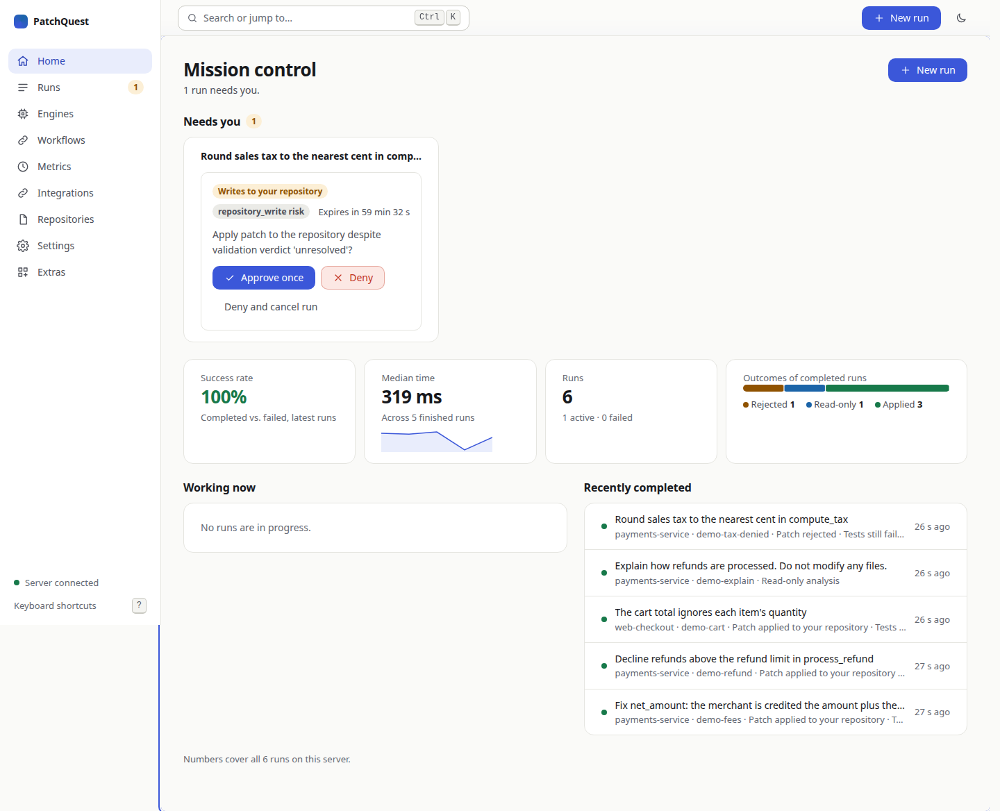
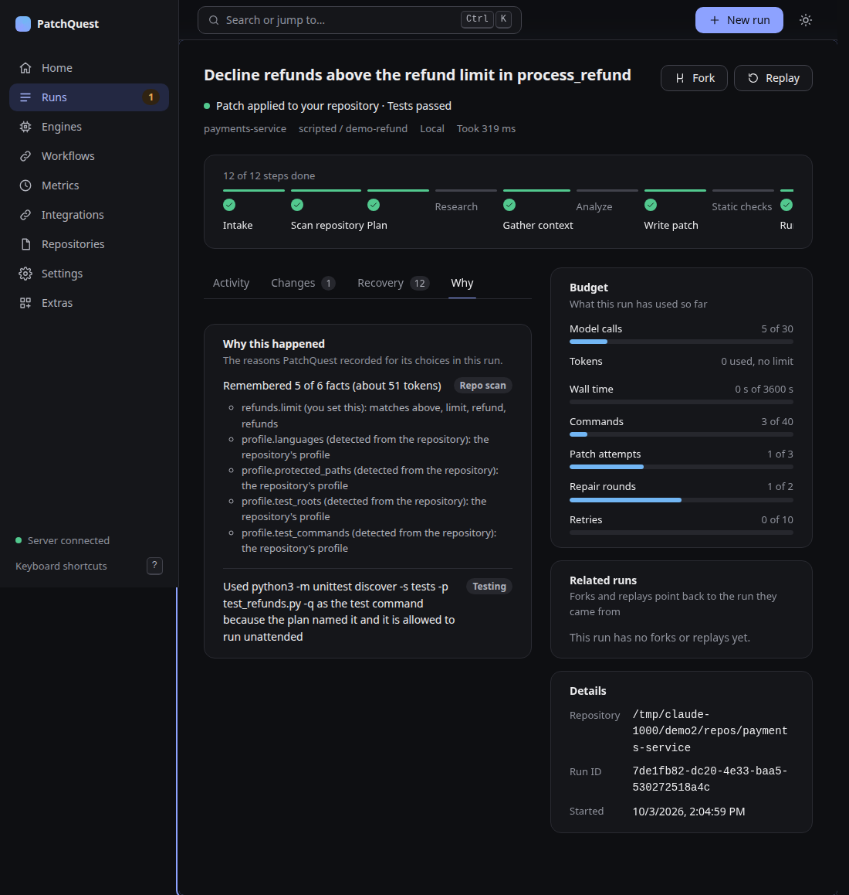
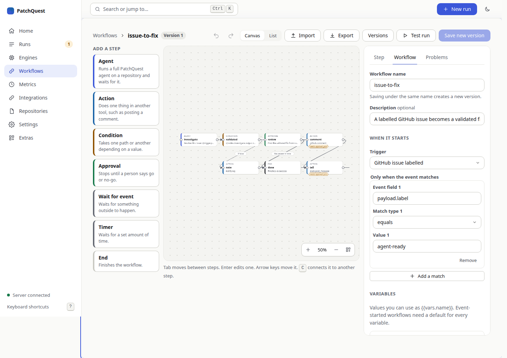
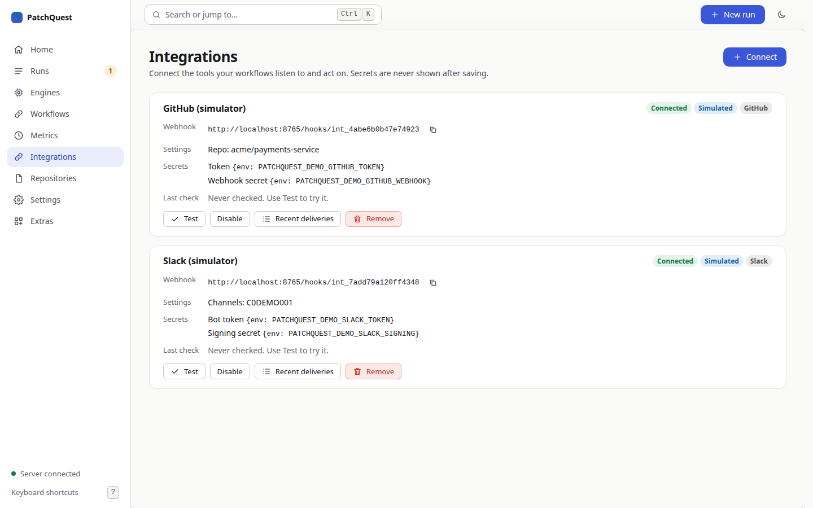
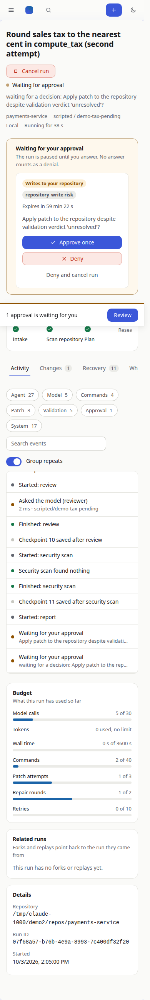
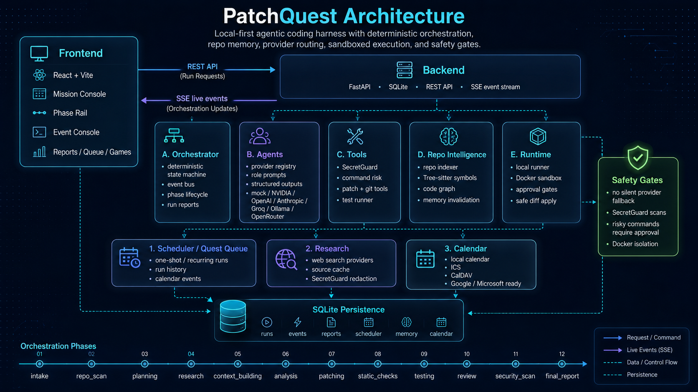

# PatchQuest

**A durable runtime for long-running agentic software work.** Coding agents are probabilistic; everything around them here is not:
changes are made in an isolated copy, validated by your own tests, and applied only by policy or a person; every step is recorded in an
append-only ledger, checkpointed, resumable after a crash, replayable and forkable; and the same engine runs on a laptop with a local
model or as a team server on PostgreSQL.



## Why it exists

Small and open-weight models fail when handed open-ended autonomy, and any agent fails when its host process dies halfway through a
change. PatchQuest treats the *harness* as the product: fixed phases, scoped context, deterministic safety checks before any command,
a ledger you can audit, and recovery rules that never repeat an uncertain write. Models are swappable (Ollama, vLLM, SGLang,
llama.cpp, LM Studio, any OpenAI-compatible endpoint, hosted APIs); the guarantees do not depend on which one runs.

## What you can do with it

| | |
|---|---|
| **Run** a task against a repository | shadow workspace -> patch -> repository tests (with repair rounds) -> review -> promotion with sha256 preconditions; human approval for risky commands and unvalidated patches |
| **Recover** | checksummed checkpoint after every phase; `resume` explains what it will do and why; worker leases; a killed worker's run is taken over by another |
| **Inspect** | every event, model call, command and decision; *why* a test command or memory was chosen; patch provenance; OTLP traces; metrics |
| **Replay and fork** | re-run from recorded model output with no model call, or fork from a checkpoint with a different model or setting |
| **Automate** | durable workflows (visual builder): GitHub/Slack/Linear/Jira/webhook triggers -> agent -> condition -> **approval** -> actions |
| **Govern** | scoped, versioned policy (strictest wins, narrower scopes can only tighten), RBAC, tenant isolation, teams, projects, audit |
| **Remember** | scoped, provenance-aware memory and preferences, a repository profile - all advisory, all below policy |
| **Extend** | manifest-declared plugins with explicit grants, containment and quarantine |
| **Measure** | evaluation corpus with hidden oracles and failure attribution, model matrix, paired experiments, context-quality scoring, an RL gym, real runs as trajectories |

<p>


</p>
<p>


</p>

## Try it (no keys, no GPU)

```bash
cd backend && python3 -m venv .venv && . .venv/bin/activate && pip install -e '.[dev]'
cd ../frontend && npm ci && npm run build && cd ../backend
patchquest demo               # http://127.0.0.1:8765 : seeded runs, a waiting approval, a workflow
patchquest demo trigger       # a signed webhook starts a real run; approve it in the UI
patchquest demo crash         # SIGKILL a worker mid-run; another finishes it, the patch is written once
```
More: [QUICKSTART](docs/QUICKSTART.md), [the demo guide](docs/demo.md). The demo's model answers and its GitHub/Slack servers are simulated and
labelled as such; the pipeline, ledger, workflow engine, policy and metrics are the real ones.

## Everyday commands

```bash
patchquest doctor                          # checks the installation and safety boundaries (doctor --bundle: a sanitized support bundle)
patchquest run --repo ~/code/app --task "Fix add() so it returns the sum" --provider sglang --model Qwen/Qwen3-0.6B --base-url http://localhost:30000/v1
patchquest status RUN | inspect RUN | events RUN | checkpoints RUN | diff RUN | report RUN | explain RUN
patchquest resume RUN [--plan]             # after a crash; explains first, asks before anything uncertain
patchquest fork RUN --from 6 --model other --set agent.max_model_calls=80
patchquest replay RUN --mode state|model|live
patchquest metrics --window 7d --by model  |  patchquest metrics --operations  |  patchquest trace RUN
patchquest policy put|list|explain|disable  |  patchquest config explain  |  patchquest memory|preferences|repo ...
patchquest repos|projects|teams ...        |  patchquest integrations add|test|list  |  patchquest plugins list|enable|invoke
patchquest queue | worker                  |  patchquest backup create|verify|restore  |  patchquest export|import RUN
patchquest eval run|compare|recovery|matrix|experiment|gate|context  |  patchquest gym rollout|dataset  |  patchquest trajectory RUN
```
Exit codes: `0` ok, `1` failed, `2` patch rejected, `3` interrupted, `4` a person must decide first, `64` usage.

## Architecture

A modular monolith with a durable worker runtime and one primary database (SQLite locally, PostgreSQL for teams) - no Kafka, Redis,
Kubernetes or vector store required. See [ARCHITECTURE](docs/ARCHITECTURE.md); the interesting parts are [runtime](docs/runtime.md),
[checkpoints](docs/checkpoints.md), [replay](docs/replay.md), [policy](docs/policy.md), [memory](docs/memory.md), [tenancy](docs/tenancy.md),
[integrations](docs/integrations.md), [plugins](docs/plugins.md), [security](docs/security.md).



## Evidence, and its limits

Claims here are the ones with a test or a measurement behind them. Labels: **TESTED** (automated), **LOAD_TESTED** (measured at volume),
**MOCKED_PROTOCOL** (against a simulator of the provider's documented behaviour, never the live service).

| Claim | Status | Where |
|---|---|---|
| Crash recovery: SIGKILL of API/worker processes at fixed points resumes correctly; the repository is written once or not at all | TESTED (real process kills, SQLite and PostgreSQL) | `backend/tests/e2e/recovery`, [failure recovery](docs/failure-recovery.md) |
| Worker killed mid-batch in real containers (API + 2 workers + PostgreSQL): every run still completed, none twice | TESTED once by hand, recorded | [deployment](docs/deployment.md) |
| A paused worker that wakes after losing its lease cannot write to the run | TESTED (the test fails when the fence is removed) | `tests/e2e/recovery/test_workers.py` |
| Tenant isolation: foreign ids are 404 through every route family; policy, memory, repositories, integrations, secrets are tenant-filtered in SQL | TESTED | `backend/tests/security` |
| Whole backend suite on SQLite *and* PostgreSQL 16 | TESTED | `PATCHQUEST_TEST_PG`, `tests/server` |
| 1,000 organisations / 5,000 users / 10,000 runs / 400,000 events; 1,000 real runs drained by 100 concurrent workers: 0 errors, 0 duplicate claims | LOAD_TESTED on one machine (PostgreSQL ran with `fsync=off`) | [benchmarks](docs/benchmarks.md) |
| GitHub, Slack, Linear, Jira, Notion, generic-webhook connectors | MOCKED_PROTOCOL only | [connectors](docs/connectors.md) |
| Context selection: 89% file recall; the `focused` strategy uses ~19% fewer tokens at the same recall | TESTED on a 42-file synthetic fixture (12 tasks); one known miss reported | [evaluation](docs/evaluation.md) |
| Live model quality | **weak**: Qwen3-0.6B solved 0 of 14 corpus tasks in the latest live run; scripted runs prove the harness, not the model | [evaluation](docs/evaluation.md), `docs/evals/` |

**Honest model results.** On the bundled 14-task corpus with Qwen3-0.6B served locally the success rate is 0 of 14 (best earlier run 1 of 14).
Harness work (reasoning-output stripping, context budgeting, apply-feedback, indentation-tolerant edits) cut time and tokens about 4x; the remaining
failures are mostly the model inventing search text that is not in the file. A 0.6B model is the floor, not the target: the corpus exists to measure a
better model and to attribute each failure to the model, the harness or the environment.

**Not done**, stated plainly: SSO/OIDC, per-tenant quotas, object-storage artifacts, Kubernetes manifests, live verification of any connector,
a multi-host test, a branch-push action (so no automatic pull requests), and an accessibility audit with
assistive technology (the UI has had one visual QA pass at desktop, laptop and phone widths, light and dark). Nothing in this repository is validated for
"thousands of teams"; the measured ceiling is in the benchmarks. Read [security](docs/security.md) for the model, the attack-pass findings and the known
limitations before relying on any of it.

## Configuration

`config.yaml` (see `sample.config.yaml`) and environment variables: `PATCHQUEST_DB`, `PATCHQUEST_DATABASE_URL` (+ `_SCHEMA`), `_HOST`, `_PORT`,
`_QUEUE_MODE`, `_WORKER_LEASE_SECONDS`, `_STATIC_DIR`, `PATCHQUEST_API_TOKEN`, `PATCHQUEST_SECRET_KEY`. Provider keys are read from the environment
variable named in the config, never stored. `patchquest config explain` shows where every effective setting came from; per-run overrides are limited to
`agent.*` and are clamped by policy ceilings.

## Develop

```bash
cd backend && ruff check . && mypy patchquest && pytest -q                 # SQLite
PATCHQUEST_TEST_PG=postgresql://user@host/db pytest -q                      # the same suite on PostgreSQL
cd frontend && npm run typecheck && npm test && npm run build
scripts/clean_install_check.sh                                              # wheel into a fresh venv, outside the checkout
```
See [CONTRIBUTING](CONTRIBUTING.md) and [SECURITY](SECURITY.md). MIT licensed.
